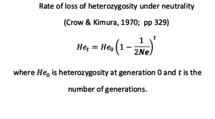
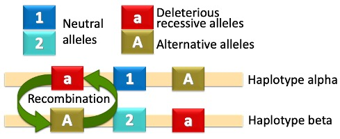

```{r setup, include=FALSE}
library(learnr)
knitr::opts_chunk$set(echo = TRUE, comment = "",
                      error = TRUE,
                      fig.width = 7,
                      fig.height = 6,
                      out.width = "80%")
```

```{r color, include=FALSE, results='asis'}
# crayon needs to be explicitly activated in Rmd
options(crayon.enabled = TRUE)
# Hooks needs to be set to deal with outputs
# thanks to fansi logic
if(requireNamespace("fansi", quietly = TRUE)) {
  old_hooks <- fansi::set_knit_hooks(knitr::knit_hooks, 
                                     which = c("output", "message", "error"))
}
```

## Let's get started

We need to load some packages here:

```{r load_packages}
setwd("/cloud/project/Luis_slimR")
path.folder_sim <- getwd()
library(knitr)
library(ggthemes)
library(snpStats)
library(slimr)
library(dplyr)
library(ggplot2)
library(raster)
library(maptools)
library(zoo)
library(viridis)
library(rgeos)
library(data.table)
library(scales)
library(ggnewscale)
library(stringr)
library(parallel)
library(future)
library(furrr)
source('hierfstat.R')
source('gHap.R')
source('rotate_matrix_2.R')
source('functions.R')
```

## Unlinked loci

Most population genetic models assume that loci are inherited by offspring as independent units from their parents (due to sexual reproduction, random mating, independent assortment of chromosomes and recombination).

However, loci that are close to each other on the same chromosome are often inherited together in clusters of different loci. This non-independent inheritance of loci will cause a non-random association between their alleles causing a linkage disequilibrium (LD) between loci.

## Linked selection

When LD occurs between two loci, one neutral and one under selection, sometimes neutral loci appear as if they are under selection ("linked selection").

Linked selection can cause the loss of genetic variation at a higher rate than expected by neutral models under two different scenarios:

a)  via selective sweeps, where a beneficial allele will be spread across the population along with the alleles that are linked to it [@smith1974], and;

b)  via background selection (BGS), where a deleterious allele will be eliminated from the population along with the alleles linked to it [@Charlesworth1994].

{width="658"}

## The slim template

We are going to use the Wright--Fisher model:

-   diploid organisms

-   hermaphroditic individuals

-   constant population size

-   reproduce in non-overlapping generations.

simulate first a large population that reproduce

1.  Create a population of size

```{r}
#define some constants first

Ne <- 30 # population size of the bottleneck
ini_pop_size <- 1000 # initial population size
gens <- 1000 # number of generations 
gen_bottleneck <- gens-100 # generation when bottleneck occurs
s_del <- 0 # selection coefficient od deleterious mutations
dominance <- 0.1 # dominance coefficient of dleterious mutations
chr_length <- 10000 # number of nucleotides of the chromosomes
mut_rate <- 3e-5 # mutation rate 
cM <- 10 # number of centiMorgans in the chromosome
rec_rate <- (cM/100)/chr_length # recombination rate

every_do <- 10 # output every X generation
```

Use the settings from df (rep, Ne and RR) and also setup the simulation.

The simulation runs Ne individuals for 50 generations (with 20 generation of a burnin with a very high mutation rate and then 30 generations with a low mutation rate to create our SNP data. Please note this needs to be set a bit longer in a real simulation. Here fairly low values to allow the simulations run fast.

We simulate simnsnps (5000) by randomly initialising a sequence of 5000 nucleotides. Then we only allow mutations from A-\>C (C-\>A) and G-\>T (T-\>G), which makes sure there are only two allelels in at a single loci.

If RR is set to 0.99 we use the recombination rate calcuated above, otherwise we use a constante recombination rate between SNPs.

At the end of a simulation create a VCF output.

```{r}
sims <- slim_script(
  
  slim_block(initialize(), {
    #setSeed(606);
    # define nucleotide based simulation
    initializeSLiMOptions(nucleotideBased=T);
    # random nucleotides
    initializeAncestralNucleotides(randomNucleotides(!!chr_length));
    # neutral mutations
    initializeMutationTypeNuc("m1", 0, "f", 0);
    # deleterious mutations
    initializeMutationTypeNuc("m2", !!dominance, "f", !!s_del);
    # setting neutral and deleterious mutations. they are equally likely to arise
    initializeGenomicElementType("g1", c(m1,m2), c(1,1), mmJukesCantor(slimr_template("mut_rate",3e-5)));
    # chromosomes
    initializeGenomicElement(g1, 0, !!chr_length-1);
    # recombiantion rate
    initializeRecombinationRate(!!rec_rate);
  }),

    slim_block(1, {
    # initial population
    sim%.%SLiMSim$addSubpop("p1", !!ini_pop_size);
  }),
  
  slim_block(!!gen_bottleneck, {
    # population bottleneck
    p1.setSubpopulationSize(!!Ne); 
    # setting off mutations
    sim.chromosome.setHotspotMap(0);
  }),
  
  # OUTPUT EVERY X GENERATION
  slim_block(1,!!gens, late(), {
    # report heterozygosity of loci with neutral mutations
    slimr_output(calcHeterozygosity(p1.genomes,muts=sim.mutationsOfType(m1)), name = "het_neutral", do_every  =!!every_do);
    # report heterozygosity of loci with deleterious mutations
    slimr_output(calcHeterozygosity(p1.genomes,muts=sim.mutationsOfType(m2)), name = "het_del", do_every  =!!every_do);
    # counting number of neutral mutations
    slimr_output(sim.countOfMutationsOfType(m1), name= "neutral", do_every  =!!every_do);
    # counting number of neutral mutations
    slimr_output(sim.countOfMutationsOfType(m2), name= "deleterious", do_every  =!!every_do);
  }),
  
  # OUTPUT AT THE END OF THE SIMULATION
  slim_block(!!gens, late(), {
    # the sequence of the two chromosomes of each individual 
    slimr_output_nucleotides_2();
    # positions os deleterious mutations
    slimr_output(p1.genomes.positionsOfMutationsOfType(m2), name= "pos_del");
    # frequencies of deleterious mutations
    slimr_output(sim.mutationFrequencies(p1, sim.mutationsOfType(m2)),name="freq");
    # finish the simulations
    sim.simulationFinished();
  })
  
)

```

## Testing effective population size (Ne)

{width="758"}

```{r}
Ne <- 500 # population size of the bottleneck
ini_pop_size <- 1000 # initial population size
gens <- 1000 # number of generations 
gen_bottleneck <- gens-100 # generation when bottleneck occurs
s_del <- 0.0 # selection coefficient od deleterious mutations
dominance <- 0.1 # dominance coefficient of dleterious mutations
chr_length <- 10000 # number of nucleotides of the chromosomes
mut_rate <- 3e-5 # mutation rate 
cM <- 100 # number of centiMorgans in the chromosome
rec_rate <- (cM/100)/chr_length # recombination rate

every_do <- 10 # output every X generation
replicates <- 5 # number of simulations replicates

rate_of_loss <- 1 - (1 / (2 * Ne))

# render script
test_Ne <- slimr_script_render(sims,template = list(mut_rate=3e-5),reps = replicates)
# run the slim scripts in parallel by defining the number of workers. Please do not use more than 2 within rcloud to save computation hours.
plan(multisession(workers = 2))
# sun simulations 
test_Ne_res <- slim_run(test_Ne, throw_error = TRUE,parallel = TRUE)
```

We use the function slim_script_render to create 18 template scripts (in a list), that includes now values for the place holders.

```{r}
# EXTRACTING DATA
df_rows <- ((gens-gen_bottleneck)/every_do) + 1
df_replicates_he <- as.data.frame(matrix(nrow =df_rows ,ncol = replicates ))
df_replicates_he_exp <- as.data.frame(matrix(nrow =df_rows ,ncol = replicates ))

for (i in 1:length(test_Ne_res)) {
  df_output <- test_Ne_res[[i]]
  df_output <- as.data.frame(cbind(df_output$output_data$generation,df_output$output_data$data,df_output$output_data$name))
  colnames(df_output) <- c("gen","He","name")
  df_output_het_neutral <- df_output[which(df_output$name=="het_neutral"),]
  df_small_pop <- df_output_het_neutral[which(df_output_het_neutral$gen==gen_bottleneck):nrow(df_output_het_neutral),]
  first_He <- as.numeric(df_output_het_neutral[which(df_output_het_neutral$gen==gen_bottleneck)-1,"He"])
  df_small_pop$rate_loss <- first_He * (rate_of_loss^(as.numeric(df_small_pop$gen)-gen_bottleneck) )
  df_replicates_he[,i] <- as.numeric(df_small_pop$He)
  df_replicates_he_exp[,i] <-  df_small_pop$rate_loss
}

df_replicates_he_res <- rowMeans(df_replicates_he)
df_replicates_he_exp_res <- rowMeans(df_replicates_he_exp)

plot_het <- as.data.frame(cbind(as.numeric(df_small_pop$gen), df_replicates_he_res,df_replicates_he_exp_res))
colnames(plot_het) <- c("gen", "He","he_exp")

all_sim <- print(ggplot(plot_het) +
                   geom_line(aes(x=gen,y=He),colour = "red",size=1) +
                   geom_line(aes(x=gen,y=he_exp),colour = "blue",size=1) +
                   theme_bw(base_size = 18) +
                   scale_fill_hc("darkunica")+
                   labs(x="GENERATIONS", y="He", title=NULL)+
                   theme(legend.title=element_blank())+
                   theme(legend.position =  "bottom") +
                   theme(legend.text=element_text(size=14)))
```

## Background selection

```{r}
Ne <- 500 # population size of the bottleneck
ini_pop_size <- 1000 # initial population size
gens <- 1000 # number of generations 
gen_bottleneck <- gens-100 # generation when bottleneck occurs
s_del <- -0.01 # selection coefficient of deleterious mutations
dominance <- 0.25 # dominance coefficient of deleterious mutations
chr_length <- 10000 # number of nucleotides of the chromosomes
mut_rate <- 3e-5 # mutation rate 
cM <- 50 # number of centiMorgans in the chromosome
rec_rate <- (cM/100)/chr_length # recombination rate

every_do <- 10 # output every X generation
replicates <- 5 # number of simulations replicates

rate_of_loss <- 1 - (1 / (2 * Ne))

# render script
BGS <- slimr_script_render(sims,template = list(mut_rate=3e-5),reps = replicates)
# run the slim scripts in parallel by defining the number of workers. Please do not use more than 2 within rcloud to save computation hours.
plan(multisession(workers = 2))
# sun simulations 
BGS_res <- slim_run(BGS, throw_error = TRUE,parallel = TRUE)

```

```{r}

# EXTRACTING DATA
df_rows <- ((gens-gen_bottleneck)/every_do) + 1
df_replicates_he <- as.data.frame(matrix(nrow =df_rows ,ncol = replicates ))
df_replicates_he_exp <- as.data.frame(matrix(nrow =df_rows ,ncol = replicates ))

for (i in 1:length(BGS_res)) {
  df_output <- test_Ne_res[[i]]
  df_output <- as.data.frame(cbind(df_output$output_data$generation,df_output$output_data$data,df_output$output_data$name))
  colnames(df_output) <- c("gen","He","name")
  df_output_het_neutral <- df_output[which(df_output$name=="het_neutral"),]
  df_small_pop <- df_output_het_neutral[which(df_output_het_neutral$gen==gen_bottleneck):nrow(df_output_het_neutral),]
  first_He <- as.numeric(df_output_het_neutral[which(df_output_het_neutral$gen==gen_bottleneck)-1,"He"])
  df_small_pop$rate_loss <- first_He * (rate_of_loss^(as.numeric(df_small_pop$gen)-gen_bottleneck) )
  df_replicates_he[,i] <- as.numeric(df_small_pop$He)
  df_replicates_he_exp[,i] <-  df_small_pop$rate_loss
}

df_replicates_he_res <- rowMeans(df_replicates_he)
df_replicates_he_exp_res <- rowMeans(df_replicates_he_exp)

plot_het <- as.data.frame(cbind(as.numeric(df_small_pop$gen), df_replicates_he_res,df_replicates_he_exp_res))
colnames(plot_het) <- c("gen", "He","he_exp")

all_sim <- print(ggplot(plot_het) +
                   geom_line(aes(x=gen,y=He),colour = "red",size=1) +
                   geom_line(aes(x=gen,y=he_exp),colour = "blue",size=1) +
                   theme_bw(base_size = 18) +
                   scale_fill_hc("darkunica")+
                   labs(x="GENERATIONS", y="He", title=NULL)+
                   theme(legend.title=element_blank())+
                   theme(legend.position =  "bottom") +
                   theme(legend.text=element_text(size=14)))

```

## What happens with lower recombination and smaller population size?

```{r}
Ne <- 20 # population size of the bottleneck
ini_pop_size <- 1000 # initial population size
gens <- 1000 # number of generations 
gen_bottleneck <- gens-100 # generation when bottleneck occurs
s_del <- -0.01 # selection coefficient of deleterious mutations
dominance <- 0.5 # dominance coefficient of deleterious mutations
chr_length <- 10000 # number of nucleotides of the chromosomes
mut_rate <- 3e-5 # mutation rate 
cM <- 50 # number of centiMorgans in the chromosome
rec_rate <- (cM/100)/chr_length # recombination rate

every_do <- 10 # output every X generation
replicates <- 10 # number of simulations replicates

rate_of_loss <- 1 - (1 / (2 * Ne))

# render script
AOD <- slimr_script_render(sims,template = list(mut_rate=mut_rate),reps = replicates)
# run the slim scripts in parallel by defining the number of workers. Please do not use more than 2 within rcloud to save computation hours.
plan(multisession(workers = 2))
# sun simulations 
AOD_res <- slim_run(AOD, throw_error = TRUE,parallel = TRUE)

```

```{r}
# EXTRACTING DATA
df_rows <- ((gens-gen_bottleneck)/every_do) + 1
df_replicates_he <- as.data.frame(matrix(nrow =df_rows ,ncol = replicates ))
df_replicates_he_exp <- as.data.frame(matrix(nrow =df_rows ,ncol = replicates ))

for (i in 1:length(AOD_res)) {
  df_output <- test_Ne_res[[i]]
  df_output <- as.data.frame(cbind(df_output$output_data$generation,df_output$output_data$data,df_output$output_data$name))
  colnames(df_output) <- c("gen","He","name")
  df_output_het_neutral <- df_output[which(df_output$name=="het_neutral"),]
  df_small_pop <- df_output_het_neutral[which(df_output_het_neutral$gen==gen_bottleneck):nrow(df_output_het_neutral),]
  first_He <- as.numeric(df_output_het_neutral[which(df_output_het_neutral$gen==gen_bottleneck)-1,"He"])
  df_small_pop$rate_loss <- first_He * (rate_of_loss^(as.numeric(df_small_pop$gen)-gen_bottleneck) )
  df_replicates_he[,i] <- as.numeric(df_small_pop$He)
  df_replicates_he_exp[,i] <-  df_small_pop$rate_loss
}

df_replicates_he_res <- rowMeans(df_replicates_he)
df_replicates_he_exp_res <- rowMeans(df_replicates_he_exp)

plot_het <- as.data.frame(cbind(as.numeric(df_small_pop$gen), df_replicates_he_res,df_replicates_he_exp_res))
colnames(plot_het) <- c("gen", "He","he_exp")

all_sim <- print(ggplot(plot_het) +
                   geom_line(aes(x=gen,y=He),colour = "red",size=1) +
                   geom_line(aes(x=gen,y=he_exp),colour = "blue",size=1) +
                   theme_bw(base_size = 18) +
                   scale_fill_hc("darkunica")+
                   labs(x="GENERATIONS", y="He", title=NULL)+
                   theme(legend.title=element_blank())+
                   theme(legend.position =  "bottom") +
                   theme(legend.text=element_text(size=14)))

```

**AOD's mechanism**

In this example for a diploid organism with a 3-locus heterozygous haplotype, deleterious recessive variants (red squares, "a") are masked by the alternative alleles (brown squares, "A") of the opposite haplotype. As a result,both haplotypes, alpha and beta, will be maintained by linked selection, along with alleles at a linked neutral locus (blue squares, "1" and "2").This type of linked selection is called associative overdominance (AOD). However, recombination events (green arrows) can alter the linkage between loci which weaken the effects of AOD on genetic diversity.

{width="730"}

## check vcf outputs

We want to check the output files. Here a quick and dirty way to read all files in and get the number of loci and heterozygosity.

```{r}
ld_threshold <- 1
MAF <- 0
size_haplo <- chr_length/100
ld_depth <- 30

AOD_visual <- AOD_res[[1]]

dna <- slim_results_to_data(AOD_res[[1]])

df_output <- as.data.frame(cbind(AOD_visual$output_data$generation,AOD_visual$output_data$data,AOD_visual$output_data$name))
colnames(df_output) <- c("gen","He","name")
df_output_het_neutral <- df_output[which(df_output$name=="het_neutral"),]
df_output_het_del <- df_output[which(df_output$name=="het_del"),]

df_output_del <- df_output[which(df_output$name=="deleterious"),]
df_output_neutral <- df_output[which(df_output$name=="neutral"),]
df_output_pos_del <- df_output[which(df_output$name=="pos_del"),]
pos_deleterious <- as.numeric(unique(unlist(strsplit(df_output_pos_del$He," "))))
pos_deleterious <- pos_deleterious[order(pos_deleterious)]
pos_deleterious <- pos_deleterious+1

 # Based on the HArdy-Weinberg equation (p^2+2pq+q^2=1), the proportion of heterozygotes 
# (2pq) for each locus is calculated and then averaged. This proportion is then multiplied by the number 
# of loci. According to Haddrill 2010, the mean
# number of heterozygous deleterious mutations per fly is 5,000 deleterious 
freqs <- dna$data[[length(dna$data)]] 
res_freq <- mean(as.numeric(freqs))
del_per_ind <-( (2*(1-res_freq)*res_freq) + (res_freq^2) ) * length(freqs)

df_output_het <- df_output_het_neutral

df_output_het$gen <- as.numeric(df_output_het$gen)
df_output_het$He <- as.numeric(df_output_het$He)

all_sim <- print(ggplot(df_output_het, aes(gen,He)) +
                   geom_line(aes(colour = "Simulations He"),size=1) +
                   theme_bw(base_size = 18) +
                   scale_fill_hc("darkunica")+
                   labs(x="GENERATIONS", y="He", title=NULL)+
                   theme(legend.title=element_blank())+
                   theme(legend.position =  "bottom") +
                   theme(legend.text=element_text(size=14)))


df_small_pop <- df_output_het[which(df_output_het$gen==gen_bottleneck):nrow(df_output_het),]
first_He <- df_output_het[which(df_output_het$gen==gen_bottleneck)-1,"He"]
df_small_pop$rate_loss <- first_He * (rate_of_loss^(df_small_pop$gen-gen_bottleneck) )

all_sim <- print(ggplot(df_small_pop) +
  geom_line(aes(x=gen,y=He),colour = "red",size=1) +
  geom_line(aes(x=gen,y=rate_loss),colour = "blue",size=1) +
  theme_bw(base_size = 18) +
  scale_fill_hc("darkunica")+
  labs(x="GENERATIONS", y="He", title=NULL)+ 
  theme(legend.title=element_blank())+
  theme(legend.position =  "bottom") +
  theme(legend.text=element_text(size=14)))

chroms <- as.character(dna$data[[length(dna$data)-2]])
chroms <- lapply(chroms,str_sub,cbind(pos_deleterious,pos_deleterious)) 
chroms <- unlist(lapply(chroms,paste0,collapse = ""))

chrom_1 <- as.character(chroms[1:Ne])
chrom_2 <- as.character(chroms[(Ne+1):(Ne*2)])

plink_map <- as.data.frame(matrix(nrow = chr_length,ncol = 4 ))
plink_map[,1] <- "1"
plink_map[,2] <- 1:chr_length
plink_map[,3] <- 1:chr_length
plink_map[,4] <- 1:chr_length
plink_map <- plink_map[pos_deleterious,]

ld_res_pop <- LD_fun(df_LD_fun=as.data.frame(cbind("Male",as.character(1:Ne),chrom_1,chrom_2)),pop_size=Ne,show_warnings=F)
colnames(plink_map) <- c("chr","c","loc_cm","loc_bp")

ld_columns_pop1 <- ld_res_pop[[1]]
snpsum.col_pop1 <- ld_res_pop[[2]]

write.table(snpsum.col_pop1,file = "snps_pop1.csv",sep = ",",row.names = F)
write.table(ld_columns_pop1,file = "ld_pop1.csv",sep = ",",row.names = T,col.names = F)

files_LD_pop1 <- dir(path.folder_sim,pattern = "ld_pop1")
files_snps_pop1 <- dir(path.folder_sim,pattern = "snps_pop1")

snp_final <- read.table(paste0(path.folder_sim,"/",files_snps_pop1[1]),header=T,sep = ",")

use <- with(snp_final, (!is.na(z.HWE_pop1))) 
# Remove NA's
use[is.na(use)] <- FALSE 
# Subset genotype and SNP summary data for SNPs that pass call rate and MAF criteria
snp_final <- snp_final[use,]

ld_matrix_2 <- read.table(paste0(path.folder_sim,"/",files_LD_pop1[1]),sep = ",",row.names = 1)

# #############################################################
# ################ HAPLOVIEW ##########################
# #############################################################

colnames(ld_matrix_2) <- rownames(ld_matrix_2)
rownames(ld_matrix_2) <- 1:nrow(ld_matrix_2)
colnames(ld_matrix_2) <- 1:ncol(ld_matrix_2)
ld_columns_2 <- as.data.frame(as.table(as.matrix(ld_matrix_2)))
ld_columns_2 <- ld_columns_2[-ld_columns_2$Freq < 0,] #remove cases where LD was not calculated
ld_columns_2$Var1 <- as.numeric(as.character(ld_columns_2$Var1))
ld_columns_2$Var2 <- as.numeric(as.character(ld_columns_2$Var2))
ld_columns_2 <- ld_columns_2[complete.cases(ld_columns_2),]
ld_columns_2$Freq <- round(ld_columns_2$Freq,1)
raster_haplo <- rasterFromXYZ(ld_columns_2)
polygon_haplo <- rasterToPolygons(raster_haplo, fun=NULL, n=4, na.rm=TRUE, digits=3, dissolve=T)
polygon_haplo <- elide(polygon_haplo,rotate=45)
polygon_haplo$id <- rownames(as.data.frame(polygon_haplo))
polygon_haplo.pts <- fortify(polygon_haplo, polygon_haplo="id") #this only has the coordinates
polygon_haplo.df <- merge(polygon_haplo.pts, polygon_haplo, by="id", type='left') # add the attributes back 
width_poly <-  round(max(polygon_haplo.df$long),0)
height_poly <-  max(polygon_haplo.df$lat)

reduce_factor <- nrow(snp_final)/width_poly
enlarge_factor <- width_poly/nrow(snp_final)
#this is to correct the cell size unit when the polygon figure is more or less than 1000 units 
correction_factor <- (width_poly/1000)

ld_matrix_3 <- ld_matrix_2
ld_matrix_3 <- as.matrix(ld_matrix_3)
dimnames(ld_matrix_3)<-NULL 
matrix_rotate <- rotate.matrix_2(x=ld_matrix_3, angle=-45, method="simple")
matrix_rotate_2 <- matrix_rotate
matrix_rotate_2[matrix_rotate_2==0] <- NA
matrix_rotate_3 <- t(na.locf(t(matrix_rotate_2), fromLast = F, na.rm = T))

means_col <- apply(matrix_rotate_3,2,mean,na.rm = T)
means_col[means_col==0] <- NA
means_col <- na.locf(means_col,fromLast =T)
means_col <- means_col * 2
df_col <- as.data.frame(matrix(ncol = 2 ,nrow = length(means_col))) 
df_col[,1] <- 1:nrow(df_col)
df_col[,2] <- means_col
df_col[,2] <-  scales::rescale(df_col[,2],to = c(0,height_poly))
means_col_2 <- means_col

mean_column <- as.numeric(summary(means_col_2,na.rm=T)[1:6])
mean_column <- scales::rescale(mean_column,to = c(0,height_poly))

# as the matrix was rotated the position of the snps is not correct anymore. the following code reassigns the snp position based on the second row from bottom to top of the rotated matrix. the first two and the last snps are removed to take in account the snps that are not present in the second row
second_row_temp <- which(!is.na(matrix_rotate_3[,1])) -1
second_row <-  second_row_temp[length(second_row_temp)]
second_row_2 <- matrix_rotate_2[second_row,]
second_row_3 <- second_row_2
reassign_loc <- snp_final$loc_bp[3:nrow(snp_final)]
reassign_loc <- reassign_loc[1:length(reassign_loc)-1]

element_reassign_loc <- 1
for(loc in 1:length(second_row_2)){
  if(is.na(second_row_2[loc])){
    next
  }else{
    second_row_3[loc] <- reassign_loc[element_reassign_loc]
    element_reassign_loc <-  element_reassign_loc + 1
  }
}

# putting back the first two snps and the last that were removed
second_row_3[1:2] <- snp_final$loc_bp[1:2]
second_row_3[length(second_row_3)] <- snp_final$loc_bp[length(snp_final$loc_bp)]
#filling the NAs
second_row_4 <- na.locf(second_row_3,fromLast=T, na.rm = F)
second_row_4 <- na.locf(second_row_4,fromLast=F, na.rm = F)

second_row_ver_2 <- na.locf(second_row_2,fromLast=T)
first_row <- which(!is.na(matrix_rotate_3[,1])) 
first_row_2 <- matrix_rotate_3[first_row,]
haplo_loc_test <- first_row_2 >= ld_threshold
haplo_loc_test <- c(haplo_loc_test,F)
start_haplo <- NULL
end_haplo <- NULL
for(i in 1:(length(haplo_loc_test)-1)){
  if( haplo_loc_test[i] == haplo_loc_test[i+1]){
    next()
  }
  
  if( haplo_loc_test[i] == T ){
    end_haplo_temp <- i
    end_haplo <- c(end_haplo,end_haplo_temp )
  }
  if( haplo_loc_test[i] == F ){
    start_haplo_temp <- i
    start_haplo <- c(start_haplo,start_haplo_temp )
  }
}

start_haplo <- c(1,start_haplo)

start_haplo_2 <-  unique(second_row_4[start_haplo])
end_haplo_2 <-  unique(second_row_4[end_haplo])
haplo_1_ver_2 <- as.data.frame(cbind(start_haplo_2,end_haplo_2))
haplo_1_ver_2$size <- (haplo_1_ver_2[,2]-haplo_1_ver_2[,1])
haplo_1_ver_2 <- haplo_1_ver_2[which(haplo_1_ver_2$size>size_haplo),]

n_snps <- as.matrix(haplo_1_ver_2[,1:2])
n_snps[,1] <- n_snps[,1]+1
n_snps <- n_snps[which(!(n_snps[,1] %in% n_snps[,2])),]

df.4.cut <- as.data.frame(table(cut(snp_final$loc_bp, breaks=n_snps)),stringsAsFactors=F)
df.4.cut_3 <- gsub("[][()]", "", df.4.cut$Var1,",")
df.4.cut_3 <- strsplit(df.4.cut_3,",")
df.4.cut_4 <- lapply(df.4.cut_3, as.numeric)
if(length(df.4.cut_4)>1){
  df.4.cut_4 <- as.data.frame(plyr::laply(df.4.cut_4,rbind))
}else{
  df.4.cut_4 <- as.data.frame(rbind(df.4.cut_4[[1]]))
}
df.4.cut_4[,3] <- (df.4.cut_4[,2]-df.4.cut_4[,1])

# this is to calculate the real distance in bp of the polygon figure of LD

real_distance <- c(0,second_row_4)
real_distance_2 <- diff(real_distance)
real_distance_3 <- cumsum(real_distance_2)
real_distance_4 <- as.data.frame(cbind(1:length(real_distance_3),real_distance_3))

test_var <- unname(unlist(df.4.cut_4[,1:2]))

location_test <- lapply(test_var, findInterval,vec = as.numeric(paste(unlist(real_distance_4$real_distance_3))))
location_test_2 <-  unlist(location_test)
test_var_2 <- as.data.frame(cbind(1:length(location_test_2),location_test_2))

hap_blocks <- as.data.frame(cbind(paste0("CHR_",1:nrow(df.4.cut_4)),
                                  rep(1,times=nrow(df.4.cut_4)),
                                  df.4.cut_4[,1:3],
                                  df.4.cut$Freq))
colnames(hap_blocks) <- c("BLOCK", "CHR" ,  "BP1" ,  "BP2"   ,"SIZE",  "NSNP" )


locations_temp <- as.data.frame(cbind(hap_blocks$BP1,hap_blocks$BP2))
locations_temp_2 <- locations_temp
colnames(locations_temp_2) <- c("start","end")
locations_temp_2$start_ld_plot <- unlist(lapply(locations_temp_2$start, findInterval,vec = as.numeric(paste(unlist(real_distance_4$real_distance_3)))))
locations_temp_2$end_ld_plot<- unlist(lapply(locations_temp_2$end, findInterval,vec = as.numeric(paste(unlist(real_distance_4$real_distance_3)))))
locations_temp_2$midpoint <-  (locations_temp_2$start + locations_temp_2$end) /2
locations_temp_2$midpoint_ld_plot <-  (locations_temp_2$start_ld_plot + locations_temp_2$end_ld_plot) /2
locations_temp_2$labels <- paste0(
  as.character(round(locations_temp_2$start/1000000,0)),"-",as.character(round(locations_temp_2$end/1000000,0))  )

haplo_temp_a <- locations_temp_2[which(as.numeric(row.names(locations_temp_2))%%2==1),]
haplo_temp_b <- locations_temp_2[which(as.numeric(row.names(locations_temp_2))%%2==0),]

ticks_breaks <- c(locations_temp_2$start_ld_plot,locations_temp_2$end_ld_plot)
ticks_breaks <- ticks_breaks[order(ticks_breaks)]
ticks_lab <- c(locations_temp_2$start,locations_temp_2$end)
ticks_lab <- round(ticks_lab/1000000,0)
ticks_lab <- as.character(ticks_lab[order(ticks_lab)])

ticks_joint <- as.data.frame(cbind(ticks_breaks,ticks_lab))
ticks_joint <- ticks_joint[!duplicated(ticks_joint$ticks_lab),]
ticks_joint$ticks_lab <- as.character(ticks_joint$ticks_lab)
ticks_joint$ticks_breaks <- as.numeric(as.character(ticks_joint$ticks_breaks))

#this is SNP's heterozygosity to be calculated alone
snp_het_alone <- snp_final[,c("loc_bp","P.AB_pop1")]
snp_het_alone$loc_bp <- 1:nrow(snp_het_alone)
snp_het_alone[,1] <- scales::rescale(snp_het_alone[,1],to = c(0,width_poly))
snp_het_alone[,2] <- snp_het_alone[,2] * height_poly

colors_haploview <- c("He"="deeppink","Recombination"="blue","Deleterious_variants"="black","Haplotypes limits"="lightgoldenrod3")
labels_haplo <- as.character(1:nrow(locations_temp_2))

haploview <- ggplot() +
  geom_rect(aes(xmin=haplo_temp_a$start_ld_plot, xmax=haplo_temp_a$end_ld_plot, ymin=min(polygon_haplo.df$lat)-20, ymax=max(polygon_haplo.df$lat)+20),color="cornsilk3",fill="cornsilk3")+
  geom_rect(aes(xmin=haplo_temp_b$start_ld_plot, xmax=haplo_temp_b$end_ld_plot, ymin=min(polygon_haplo.df$lat)-20, ymax=max(polygon_haplo.df$lat)+20),color="cornsilk4",fill="cornsilk4")+
  geom_polygon(data=polygon_haplo.df, aes(long,lat,group=group, fill=Freq)) +
  scale_fill_viridis(name="R squared (LD)",option= "viridis") +
  geom_vline(aes(xintercept =c(haplo_temp_b$start_ld_plot,haplo_temp_b$end_ld_plot),color="Haplotypes limits"),size=1/2)+
  
  geom_line(data=snp_het_alone,aes(x=loc_bp,y=P.AB_pop1,color= "He"),inherit.aes = F,size=0.5,alpha=0.8)+
  annotate("text", x = locations_temp_2$midpoint_ld_plot, y = max(polygon_haplo.df$lat)+12, label = labels_haplo ,size=2) +
  annotate("text", x = locations_temp_2$midpoint_ld_plot, y = min(polygon_haplo.df$lat)-12, label = locations_temp_2$labels ,size=1) +
  # labs( x= "Chromosome location (Mbp)", y="Het",title=paste("Chromosome","-",nrow(plot_het),"SNP's"))+
  scale_x_continuous(breaks= ticks_joint$ticks_breaks, labels=ticks_joint$ticks_lab)+
  scale_colour_manual(name="",values=colors_haploview) +
  theme_tufte(base_family="Helvetica") +
  theme(legend.position = "bottom",
        axis.ticks.y = element_blank(),
        axis.title.y = element_blank(), 
        axis.text.y = element_blank(),
        axis.title.x = element_text(hjust =0.5),
        axis.ticks.x = element_blank(),
        axis.text.x = element_blank())+
  coord_fixed(ratio = 1/1)

print(haploview)


offspring_ld_pop1 <- as.data.frame(cbind("Male",as.character(1:Ne),chrom_1,chrom_2))
# offspring_ld_pop2 <- pop2

offspring_ld_pop1$V1[offspring_ld_pop1$V1=="Male"]   <- 1
offspring_ld_pop1$V1[offspring_ld_pop1$V1=="Female"] <- 2
offspring_ld_pop1$V2 <- paste0("offspring_","pop1")
offspring_ld_pop1$id <- paste0("pop1_",row.names(offspring_ld_pop1))


samples_haplotypes <-  offspring_ld_pop1
samples_haplo <- samples_haplotypes[,c("V2","id")]
chromosomes_pop <- c(samples_haplotypes$chrom_1,samples_haplotypes$chrom_2)

chromosomes_pop <- gsub("G", "1", chromosomes_pop) # converting allele names to numbers
chromosomes_pop <- gsub("C", "0", chromosomes_pop)
chromosomes_pop <- gsub("A", "1", chromosomes_pop) # converting allele names to numbers
chromosomes_pop <- gsub("T", "0", chromosomes_pop)

find_haplo <- strsplit(chromosomes_pop,split = "")
find_haplo_2 <- data.frame((sapply(find_haplo,c)), stringsAsFactors = F)
# find_haplo_2 <- find_haplo_2[snp_final$row_name,]
ref <- "A"
alt <- "a"
info_haplo <- as.data.frame(cbind(1,(1:nrow(plink_map)),plink_map$loc_bp,ref,alt), stringsAsFactors = F)
# info_haplo <- info_haplo[snp_final$row_name,]
colnames(info_haplo) <- c("chr","marker","pos","ref","alt")
find_haplo_3 <- cbind(info_haplo,find_haplo_2) 
snp_final_2 <- read.table(paste0(path.folder_sim,"/",files_snps_pop1[1]),header=T,sep = ",")

markers_haplo <-  find_haplo_3[,1:5]
markers_haplo$pos <- as.numeric(as.character(markers_haplo$pos))

phase_haplo <- find_haplo_3[,6:ncol(find_haplo_3)]

phase_haplo_2 <- ghap.loadphase(
  samples.file=samples_haplo,
  markers.file=markers_haplo,
  phase.file=phase_haplo,
  verbose = TRUE
)

ghap.haplotyping(phase=phase_haplo_2, blocks=hap_blocks, outfile="res_haplo", freq = c(0,1), drop.minor = F, batchsize = 500, ncores = 1, verbose = TRUE)

haplo <- ghap.loadhaplo("res_haplo.hapsamples", "res_haplo.hapalleles", "res_haplo.hapgenotypes")
files_to_delete <- c("res_haplo.hapsamples", "res_haplo.hapalleles", "res_haplo.hapgenotypes")
files_to_delete <- paste0(getwd(),"/",files_to_delete)
unlink(files_to_delete)
hapstats <- ghap.hapstats(haplo, ncores = 2)
blockstats <- ghap.blockstats(hapstats, ncores = 2)

location_hap <- lapply(hapstats$BP1, findInterval, 
                       vec = as.numeric(paste(unlist(real_distance_4$real_distance_3))))
hapstats_2 <- hapstats[,c("BLOCK","BP1","ALLELE","FREQ")]
hapstats_2$BP1 <- c(location_hap)
hapstats_2$BLOCK <- as.factor(hapstats_2$BLOCK)

split_haplo <- split(hapstats_2,hapstats_2$BLOCK)
split_haplo <- lapply(split_haplo,function(x){x[order(x$FREQ,decreasing = T),]})
split_haplo2 <- lapply(split_haplo,"[",,c("BP1","ALLELE"))
position_hap <- lapply(split_haplo2,"[[",1,1)
position_hap <- unlist(position_hap)
position_hap <- position_hap 

split_haplo3 <- lapply(split_haplo2,function(x){strsplit(x$ALLELE,split = "") } )
split_haplo4 <- lapply(split_haplo3,sapply,rbind)
split_haplo5 <- lapply(split_haplo4,t)
for(i in 1:length(position_hap)){
  col_num <- ncol(split_haplo5[[i]]) -1
  row_num <- nrow(split_haplo5[[i]])
  col_names_haplo <- seq( position_hap[i] , position_hap[i]+(enlarge_factor*col_num) ,enlarge_factor)
  colnames(split_haplo5[[i]]) <- col_names_haplo
  rownames(split_haplo5[[i]]) <-  seq( 1 , (enlarge_factor*row_num) ,enlarge_factor)
}
split_haplo6 <- lapply(split_haplo5,function(x){as.data.frame(as.table(x))})

plot_haplo <- rbindlist(split_haplo6,fill = T)
plot_haplo$Var1 <- as.numeric(as.character(plot_haplo$Var1))
plot_haplo$Var1 <- 1-(plot_haplo$Var1)
plot_haplo$Var1 <- (plot_haplo$Var1)-2
plot_haplo$Var2 <- as.numeric(as.character(plot_haplo$Var2))
plot_haplo$Freq <- as.factor(plot_haplo$Freq)

#this is SNP's heterozygosity to be calculated alone
snp_het_alone <- snp_final[,c("loc_bp","P.AB_pop1")]
snp_het_alone$loc_bp <- 1:nrow(snp_het_alone)
snp_het_alone[,1] <- rescale(snp_het_alone[,1],to = c(0,width_poly))
snp_het_alone[,2] <- snp_het_alone[,2] * height_poly

ticks_df <- real_distance_4
ticks_df$real_distance_3 <- round(ticks_df$real_distance_3/1000000,1) 
ticks_df_2 <- ticks_df[which(ticks_df$real_distance_3 %% 0.5 == 0),]
colnames(ticks_df_2) <- c("V1","V2")
unique_val <- c(TRUE,diff(ticks_df_2$V2)!=0)
ticks_df_3 <- ticks_df_2[unique_val,]
ticks_lab <- as.character(ticks_df_3$V2)
ticks_breaks <- ticks_df_3$V1

cols <- c("SNP's"="lightgoldenrod","Msats observed"="deeppink","Msats expected"="cyan")

p1 <- ggplot() +
  geom_polygon(data=polygon_haplo.df, aes(long,lat,group=group, fill=Freq)) +
  scale_fill_viridis(name="R square",option= "viridis") +
  new_scale("fill") +   
  # geom_vline(xintercept = test_var_2$location_test_2,color="red",size=1/2)+
  geom_rect(data = plot_haplo, aes(xmin=Var2, xmax=Var2+enlarge_factor, ymin=Var1, ymax=Var1+enlarge_factor,fill=Freq),color="black",size=1/10,inherit.aes = F) +
  scale_fill_manual(values = c("red", "blue","black"), labels = c("Deleterious", "Alternative"))+
  # geom_line(data=df_col,aes(x=V1,y=V2),color="orange",inherit.aes = F,size=1/2) +
  # geom_hline(yintercept = mean_column[2],color="red",size=1/2)+
  
  # geom_step(data=recom_haplo,aes(x=recom_haplo$V1,y=recom_haplo$V2),color="white",inherit.aes = F,size=1/2) +
  # labs(x=NULL, y="Haplotypes", title="Simulation with a chromosome of 500 cM",subtitle = paste(nrow(snp_final),"SNP's ","mean Fst = ",round(final_res[1,18],2)," mean He = ",round(final_res[1,15],2),"s = ", s_gral,"h = ", h_gral,"q = ",q_gral, " with ",loci_number, " initial loci" ))+ 
  scale_x_continuous(breaks=ticks_breaks, labels=ticks_lab)+
  theme_tufte(base_family="Helvetica") +
  theme(legend.position = "none",
        axis.title.x=element_blank(),
        axis.title.y=element_text(angle = 0,face = "bold",size = 12,hjust=0,vjust=0.5),
        axis.ticks = element_blank(),
        axis.ticks.y=element_blank() ,
        axis.ticks.x=element_blank() ,
        axis.text.y = element_blank(),
        plot.margin=unit(c(0,1,-1,1), "in"),
        # legend.justification =c(0,0),
        # legend.margin=margin(0,0,0,0, unit = "in"),
        # legend.box.margin=margin(-1,0,0,0, unit = "in"),
        # legend.box.spacing= unit(0, "in"),
        plot.title = element_text(face = "bold",size = 14,hjust=0,vjust=0.5),
        axis.text.x = element_blank()) +
  coord_fixed(ratio = 1/1)


# ggplotly(p1)


```

## Run Neestimator from within R

Now that we have our 18 simulations the next step is the following:

1.  sample different levels of SNPs (snplevels)
2.  sample different levels of individuals (sslevels)
3.  Run Neestimator over all levels for all 18 simulations
4.  Collect the results from the Nestimator results into a data.frame
5.  Visualise the results.

The idea here is the following. steps 1-3 are wrapped into a simulation function. Then we run the simulation function via an mcapply, which allows to run the jobs in parallel if needed.

```{r}


```

## Collect the results

All the is needed todo is now collect the results from the data.frame and plot

Step 4 and 5 below:

```{r}


#stop the clock
toc()
```
